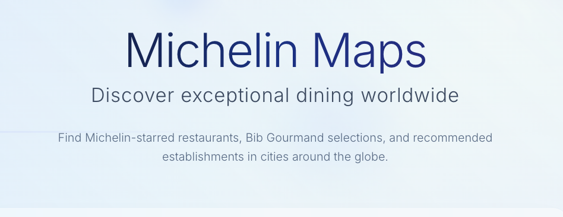
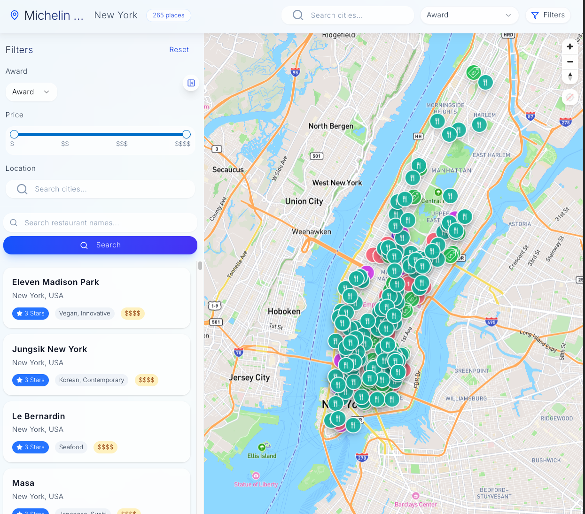

# Michelin Maps

[](https://vercel.com/jespinoza17s-projects/v0-michelin-star-mapping)
[](https://v0.dev/chat/projects/UoJc4A6CQ5x)

An interactive web application for discovering Michelin-starred restaurants, Bib Gourmand selections, and recommended establishments worldwide. Built with Next.js, TypeScript, and Mapbox for a premium dining discovery experience.



## Purpose

Michelin Maps transforms the way food enthusiasts discover exceptional dining experiences by providing:

- **Interactive Map Interface**: Explore restaurants with an intuitive, beautiful map powered by Mapbox
- **Comprehensive Michelin Data**: Access Michelin-starred restaurants, Bib Gourmand selections, and recommended establishments
- **Advanced Filtering**: Filter by award types, price ranges, cuisines, and more
- **City-Based Discovery**: Search and explore restaurants by city or country
- **Mobile-Optimized**: Responsive design for discovery on any device



## Overview

This project was initialized with [v0.dev](https://v0.dev) and developed collaboratively using Claude Code and Cursor. The application combines modern web technologies with comprehensive restaurant data to create an exceptional user experience for discovering world-class dining.

## Tech Stack

- **Framework**: Next.js 15 with App Router
- **Language**: TypeScript
- **Styling**: Tailwind CSS
- **Database**: Supabase (PostgreSQL)
- **Maps**: Mapbox GL JS
- **UI Components**: Radix UI
- **Analytics**: Mixpanel
- **Deployment**: Vercel

## Getting Started

### Prerequisites

- Node.js 18+ and npm/pnpm
- A [Mapbox](https://mapbox.com) account and access token
- A [Supabase](https://supabase.com) project for database

### Installation

1. **Clone the repository**
   ```bash
   git clone https://github.com/your-username/michelin-maps.git
   cd michelin-maps
   ```

2. **Install dependencies**
   ```bash
   npm install
   # or
   pnpm install
   ```

3. **Set up environment variables**
   Create a `.env.local` file in the root directory:
   ```env
   NEXT_PUBLIC_MAPBOX_ACCESS_TOKEN=your_mapbox_token_here
   NEXT_PUBLIC_SUPABASE_URL=your_supabase_url
   NEXT_PUBLIC_SUPABASE_ANON_KEY=your_supabase_anon_key
   ```

4. **Set up the database**
   ```bash
   npm run seed
   ```

5. **Run the development server**
   ```bash
   npm run dev
   ```

6. **Open [http://localhost:3000](http://localhost:3000)** in your browser

### Build Commands

```bash
# Development
npm run dev

# Build for production
npm run build

# Start production server
npm run start

# Lint code
npm run lint

# Database operations
npm run seed        # Seed the database with restaurant data
npm run seed:clear  # Clear all restaurant data
npm run seed:count  # Count restaurants in database
```

## Development Story

This project showcases modern AI-assisted development:

- **Initialized**: Started with v0.dev for rapid prototyping and component generation
- **Developed**: Enhanced and customized using Claude Code for systematic feature development
- **Refined**: Polished with Cursor for detailed code improvements and optimizations

The combination of these tools enabled rapid development while maintaining code quality and implementing complex features like interactive mapping and advanced filtering.